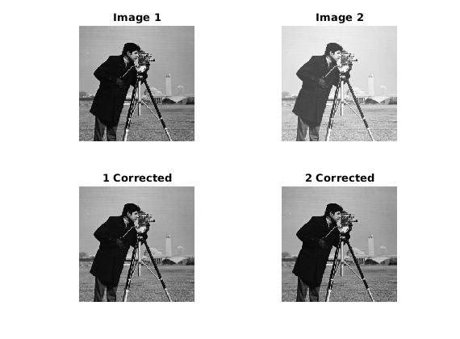

# matlab-histogram-matching
Implementation of histogram matching and specification algorithms.

## Implemented

[**Midway Image Equalization**](https://doi.org/10.5201/ipol.2016.140): `midway_image_eq.m`

#### Example
```matlab
A = double(imread("cameraman.tif"));
B = round(sin(0.5*pi*double(A)/255)*200 + 55);
B(B>255) = 255;
V = {A, B};

% Histogram equalize
[U, H_midway, H, H_inv] = midway_image_eq(V);
```



## To Do

[**Dynamic histogram warping of image pairs for constant image brightness**](https://ieeexplore.ieee.org/stamp/stamp.jsp?tp=&arnumber=537491)